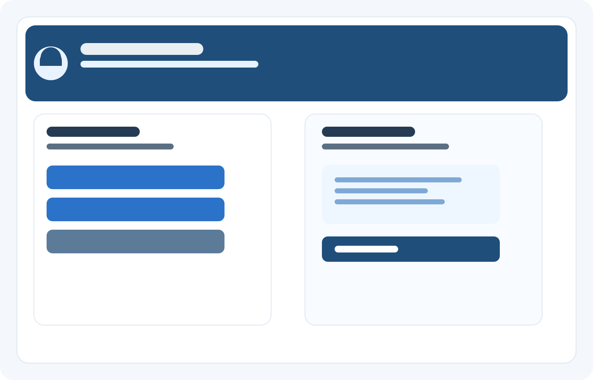

# Sara Huston - Project Portfolio

A collection of projects that blend human-centered design, health technology, and analytical problem solving.

---

## 🏥 Care Companion
A calm, supportive digital experience designed to help someone stay on top of daily wellness routines with less stress.

This project focuses on comfort, clarity, and consistency through a simple interface that makes it easy to:
- log sleep and mood
- review weekly progress
- receive gentle reminders
- feel supported in everyday care

### Visual Preview

### Highlights
- Warm, approachable product experience
- Clear daily-care dashboard
- Reminder-driven engagement
- Designed for real-world emotional support, not just functionality

### Tech Snapshot
Python · UI design · wellness app experience

---

## 📊 Optimization Model for Supply Chain and Production Planning
A data-driven optimization project focused on improving planning decisions for a mock production environment.

### Highlights
- Built a structured decision model for supply chain planning
- Improved profitability through better production and sales choices
- Balanced operational constraints with long-term planning goals

### Tech Snapshot
MMXPRS · Fico Xpress · Mosel

---

## License
This project is for portfolio and educational purposes.
