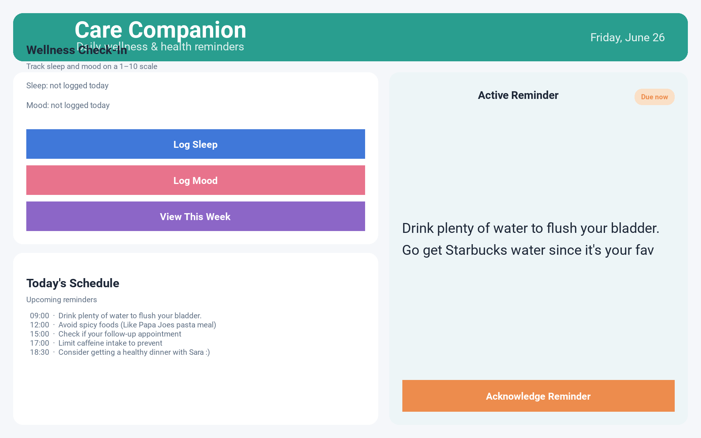

# Care Companion (Mom's Cancer Health App)

A Python/Kivy desktop app built to support a family member through bladder cancer treatment. **Care Companion** delivers scheduled, research-backed care prompts; logs daily sleep and mood ratings to SQLite; surfaces a weekly summary with 7-day averages and a logging-streak counter; and escalates low-mood entries to a designated caregiver via an email-to-SMS gateway.

## Screenshots

### Main dashboard (demo mode — active reminder)



> **Tip:** Run `.\launch_demo.ps1` to open this demo state locally, or use `Win + G` to record a short walkthrough video for your portfolio.

## Features

- **Card-based UI** — wellness check-in, schedule list, and active reminder panel with status badges
- Configurable daily reminders loaded from `data/reminders.json` (graceful fallback if missing/invalid)
- Idempotent per-day reminder state — each reminder fires at most once per calendar day
- Sleep & mood logging (1–10), persisted in SQLite with input validation
- Weekly summary view: 7-day averages + logging-streak counter with milestone celebrations (7 / 30 / 100 days)
- Low-mood SMS alert sent over Gmail SMTP through a carrier email gateway (Verizon / AT&T / T-Mobile / Sprint)
- Demo mode for screenshots and portfolio videos (`--demo`, `--screenshot`, `--no-audio`)
- Secrets and contact info loaded from environment variables — nothing personal is committed

## Tech stack

Python 3.12 · Kivy 2.3 · SQLite · `smtplib` · PyInstaller · pytest

## Layout

```
mom-cancer-health-app/
├── HealthApp.py          # Kivy UI + app entry point
├── storage.py            # SQLite persistence: logs, streaks, weekly summary
├── reminders.py          # JSON-driven reminder schedule with safe fallback
├── ui_theme.py           # Color palette and design tokens
├── ui_components.py      # Reusable cards, buttons, badges
├── data/                 # reminders.json + generated health_app.db
├── docs/screenshots/     # Product screenshots for README and portfolio
├── assets/               # images & audio (optional)
├── tests/                # pytest suite for storage layer
├── launch_demo.ps1       # Demo mode for screenshots / video capture
├── run.ps1               # Normal launch script (Windows)
├── requirements.txt      # Runtime dependencies
├── HealthApp.spec        # PyInstaller build spec
└── .env.example          # Template for required environment variables
```

## Setup

**Windows (recommended):**

```powershell
uv venv .venv --python 3.12
uv pip install --python .venv -r requirements.txt
copy .env.example .env   # then fill in real values
```

**Any platform:**

```bash
pip install kivy pytest
cp .env.example .env
```

Required environment variables (see `.env.example`):

| Variable | Purpose |
| --- | --- |
| `HEALTH_APP_EMAIL` | Gmail address used as the SMTP sender |
| `HEALTH_APP_PASSWORD` | Gmail [App Password](https://myaccount.google.com/apppasswords) |
| `HEALTH_APP_CAREGIVER_PHONE` | 10-digit phone number to notify on low-mood entries |

If any of these are unset, the app still runs normally — only the SMS alert is skipped, and the failure is surfaced in the UI.

## Run

**Normal use:**

```powershell
.\run.ps1
# or: python HealthApp.py
```

**Demo mode (screenshots / portfolio video):**

```powershell
.\launch_demo.ps1
# or: python HealthApp.py --demo --no-audio --screenshot
```

Demo mode opens a 1280×800 window with a sample active reminder, seeds weekly history data, skips startup audio, and saves a screenshot to `docs/screenshots/`.

## Tests

```bash
pytest -q tests/
```

All 8 storage-layer tests should pass. CI runs the same suite on every push and PR (`.github/workflows/ci.yml`).
